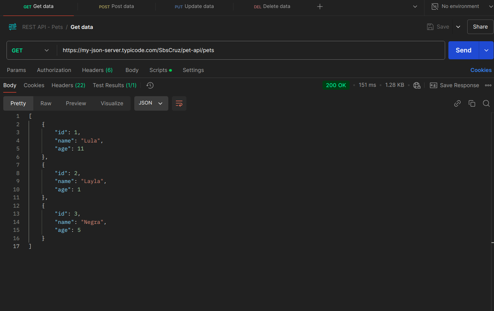
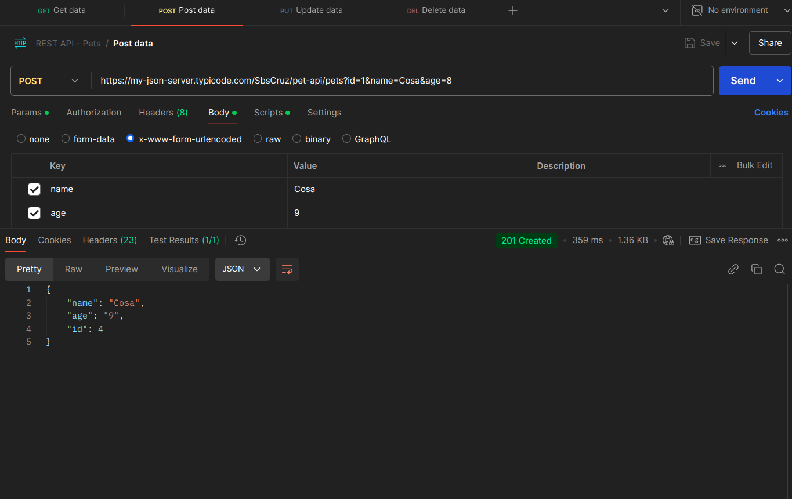
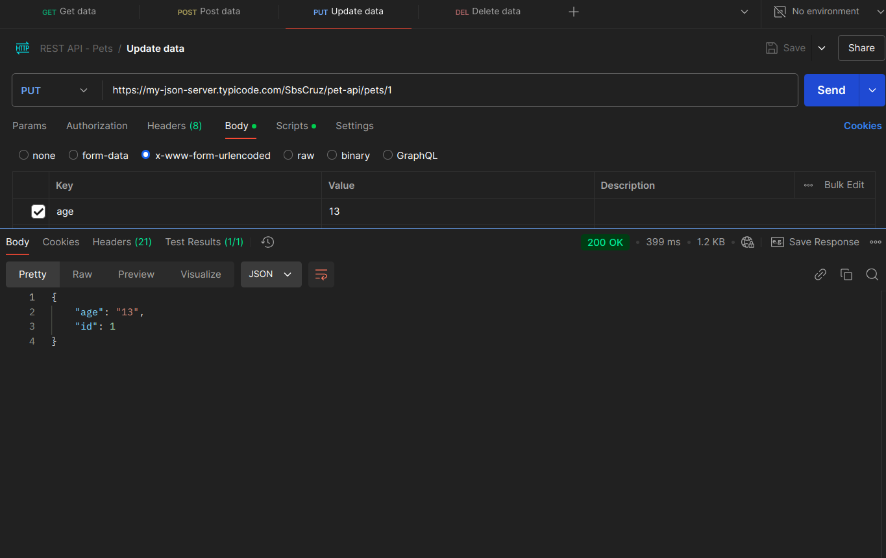
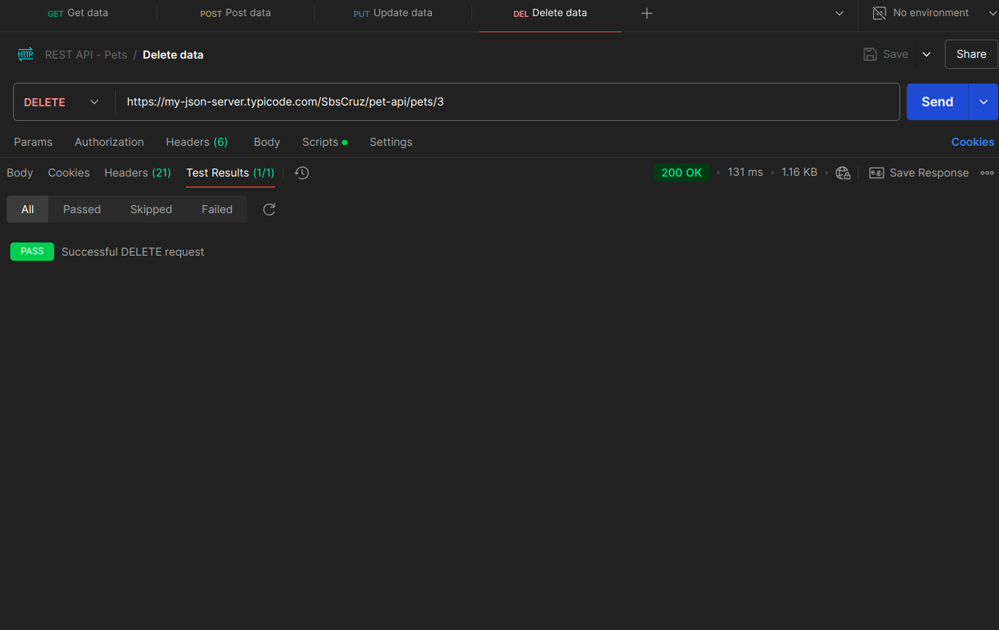

# Pet-API

This API was developed in [My JSON Server](https://my-json-server.typicode.com/)
as a part of [StackBuilders](https://www.stackbuilders.com/) training course.

## GET

## POST

## PUT

## DELETE
